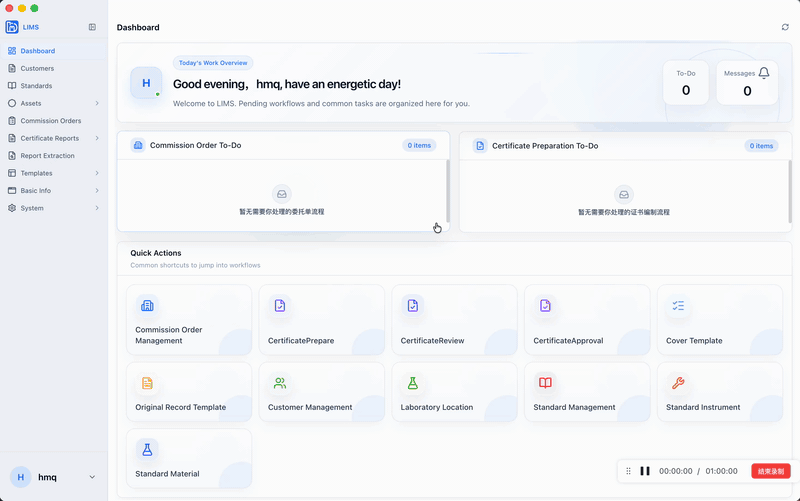
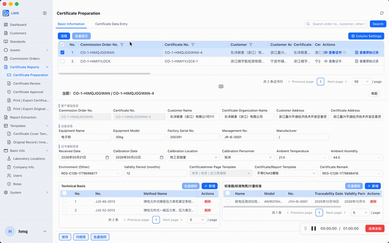
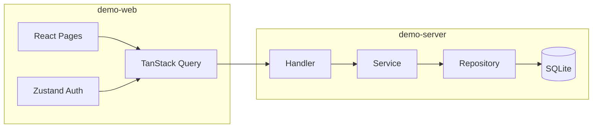

# LIMS Stack Demo

从生产级实验室信息管理系统（LIMS）中提炼的**个人全栈开源 Demo**：保留真实项目里的分层架构、统一 API 约定与乐观锁更新模式，去掉租户、权限矩阵、Electron、Excel/PDF、异步 Worker 等重型能力，方便学习与二次开发。

[](demo-server)
[](demo-web)
[](LICENSE)

## 演示

| 登录与笔记总览 | 笔记增删改查 |
|:---:|:---:|
|  |  |

> 默认账号：`demo` / `demo123`

## 为什么做这个仓库

完整 LIMS 代码量大、领域强绑定，不适合直接当「全栈样板」阅读。本仓库只保留一条可跑通的核心链路：

```
浏览器 → JWT 鉴权 → REST API → Service 事务与校验 → Repository → SQLite
```

你可以把它当作：

- 简历 / 博客附带的 **可运行作品集**
- Go + React 分层项目的 **最小参考实现**
- 向完整 LIMS 迁移前的 **架构预习**

## 技术栈

| 层级 | 目录 | 技术 |
|------|------|------|
| 后端 | [`demo-server`](./demo-server) | Go · Gin · GORM · SQLite · JWT |
| 前端 | [`demo-web`](./demo-web) | React · TypeScript · Vite · TanStack Query · Zustand · Tailwind CSS |

### 架构示意



### 与完整 LIMS 的对应关系

| Demo 能力 | 完整 LIMS（私有仓库）中的形态 |
|-----------|------------------------------|
| `Handler → Service → Repository` | 同模式，模块更多 |
| `/api/v1` + `{ code, message, data }` | 统一响应与 `apperror` |
| 删除/更新带 `updated_at` CAS | 主数据乐观锁 |
| JWT 登录 | 多租户 + Refresh + 权限码 |
| 笔记 CRUD | 标准、委托单、证书等域 |

## 快速开始

### 环境要求

- Go 1.22+
- Node.js 20+ 与 [pnpm](https://pnpm.io/)
- （可选）ffmpeg — 仅当你需要自行从录屏重新生成 README 中的 GIF

### 1. 启动后端

```bash
cd demo-server
cp .env.example .env
go run ./cmd/server
```

默认监听 `http://localhost:8080`，SQLite 文件位于 `./data/demo.db`（首次启动自动建表并种子用户）。

### 2. 启动前端

```bash
cd demo-web
cp .env.example .env
pnpm install
pnpm dev
```

浏览器打开 Vite 提示的地址（通常 `http://localhost:5173`），使用 `demo` / `demo123` 登录。

### 环境变量

**demo-server**（见 [`demo-server/.env.example`](./demo-server/.env.example)）

| 变量 | 说明 | 默认 |
|------|------|------|
| `HTTP_ADDR` | 监听地址 | `:8080` |
| `JWT_SECRET` | JWT 签名密钥 | 开发用占位值 |
| `DATABASE_PATH` | SQLite 路径 | `./data/demo.db` |
| `CORS_ORIGINS` | 允许的前端源 | `http://localhost:5173` |

**demo-web**（见 [`demo-web/.env.example`](./demo-web/.env.example)）

| 变量 | 说明 |
|------|------|
| `VITE_API_BASE_URL` | 后端根地址，如 `http://localhost:8080` |

## API 一览

| 方法 | 路径 | 说明 |
|------|------|------|
| `POST` | `/api/v1/auth/login` | 登录，返回 `access_token` |
| `GET` | `/api/v1/notes` | 分页列表，`keyword` / `page` / `page_size` |
| `POST` | `/api/v1/notes` | 创建笔记 |
| `GET` | `/api/v1/notes/:id` | 详情 |
| `PUT` | `/api/v1/notes/:id` | 更新（body 含 `updated_at`） |
| `DELETE` | `/api/v1/notes/:id` | 删除（query `updated_at`） |

成功响应示例：

```json
{
  "code": 0,
  "message": "ok",
  "data": { }
}
```

分页列表的 `data` 形如 `{ "list": [], "total": 0, "page": 1, "page_size": 20 }`。

## 目录结构

```
.
├── demo-server/          # Go API
│   ├── cmd/server/       # 入口
│   └── internal/         # handler · service · repository · pkg
├── demo-web/             # React SPA
│   └── src/              # pages · api · hooks · stores
├── docs/assets/          # README 演示 GIF
├── LICENSE
└── README.md
```

## 开发说明

```bash
# 后端编译
cd demo-server && go build -o bin/server ./cmd/server

# 前端类型检查与构建
cd demo-web && pnpm type-check && pnpm build
```

## 安全提示

- 勿将 `.env`、数据库文件或真实 JWT 密钥提交到公开仓库。
- Demo 账号与密钥仅用于本地开发，**禁止**直接用于生产。

## License

[MIT](LICENSE) © MingQi
