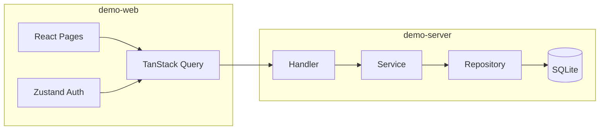

# LIMS Stack Demo

A **personal full-stack portfolio project** distilled from a production Laboratory Information Management System (LIMS). It keeps the layering, API conventions, and optimistic-locking patterns from the real codebase, while dropping multi-tenancy, RBAC, Electron, Excel/PDF pipelines, and background workers so the repo stays small and easy to explore.

[](demo-server)
[](demo-web)
[](LICENSE)

## Demo

| Sign-in & notes overview | Notes CRUD |
|:---:|:---:|
|  |  |

> **Demo credentials:** `demo` / `demo123`

## Why this repo exists

The full LIMS is large and domain-specific—not ideal as a generic “full-stack template.” This repository exposes one runnable slice:

```
Browser → JWT auth → REST API → Service layer → Repository → SQLite
```

Use it as:

- A **runnable portfolio piece** for résumés and blog posts  
- A **minimal reference** for Go + React layered backends  
- A **preview** of how a much larger LIMS backend is structured  

## Tech stack

| Layer | Path | Stack |
|-------|------|--------|
| Backend | [`demo-server`](./demo-server) | Go · Gin · GORM · SQLite · JWT |
| Frontend | [`demo-web`](./demo-web) | React · TypeScript · Vite · TanStack Query · Zustand · Tailwind CSS |

### Architecture



### What carries over from production LIMS

| In this demo | In the full private LIMS |
|--------------|---------------------------|
| Handler → Service → Repository | Same pattern, many more modules |
| `/api/v1` + `{ code, message, data }` | Unified envelope + structured errors |
| Updates/deletes with `updated_at` CAS | Optimistic locking on master data |
| JWT login | Multi-tenant auth, refresh tokens, permission codes |
| Notes CRUD | Standards, orders, certificates, assets, etc. |

## Quick start

### Prerequisites

- Go 1.22+
- Node.js 20+ and [pnpm](https://pnpm.io/)
- (Optional) ffmpeg — only if you want to regenerate README GIFs from screen recordings

### 1. Start the API

```bash
cd demo-server
cp .env.example .env
go run ./cmd/server
```

Listens on `http://localhost:8080` by default. SQLite lives at `./data/demo.db` (schema + demo user are created on first run).

### 2. Start the web app

```bash
cd demo-web
cp .env.example .env
pnpm install
pnpm dev
```

Open the URL Vite prints (usually `http://localhost:5173`) and sign in with `demo` / `demo123`.

### Environment variables

**demo-server** — see [`demo-server/.env.example`](./demo-server/.env.example)

| Variable | Description | Default |
|----------|-------------|---------|
| `HTTP_ADDR` | Listen address | `:8080` |
| `JWT_SECRET` | JWT signing secret | dev placeholder |
| `DATABASE_PATH` | SQLite file path | `./data/demo.db` |
| `CORS_ORIGINS` | Allowed browser origins | `http://localhost:5173` |

**demo-web** — see [`demo-web/.env.example`](./demo-web/.env.example)

| Variable | Description |
|----------|-------------|
| `VITE_API_BASE_URL` | API origin, e.g. `http://localhost:8080` |

## API overview

| Method | Path | Description |
|--------|------|-------------|
| `POST` | `/api/v1/auth/login` | Sign in; returns `access_token` |
| `GET` | `/api/v1/notes` | Paginated list (`keyword`, `page`, `page_size`) |
| `POST` | `/api/v1/notes` | Create a note |
| `GET` | `/api/v1/notes/:id` | Get one note |
| `PUT` | `/api/v1/notes/:id` | Update (body includes `updated_at`) |
| `DELETE` | `/api/v1/notes/:id` | Delete (query `updated_at`) |

Successful response shape:

```json
{
  "code": 0,
  "message": "ok",
  "data": {}
}
```

Paged lists return `data` as `{ "list": [], "total": 0, "page": 1, "page_size": 20 }`.

## Project layout

```
.
├── demo-server/          # Go API
│   ├── cmd/server/       # entrypoint
│   └── internal/         # handler · service · repository · pkg
├── demo-web/             # React SPA
│   └── src/              # pages · api · hooks · stores
├── docs/assets/          # README demo GIFs
├── LICENSE
└── README.md
```

## Development

```bash
# Build API binary
cd demo-server && go build -o bin/server ./cmd/server

# Type-check and build frontend
cd demo-web && pnpm type-check && pnpm build
```

## Security

- Do not commit `.env` files, SQLite databases, or production JWT secrets.  
- Demo credentials and secrets are for **local development only**—not production.  

## License

[MIT](LICENSE) © MingQi
